# 📄 Звіт з лабораторної роботи №5: Оптимізація та аудит БД PostgreSQL

---

## ℹ️ Загальна інформація
* **ПІБ студента:** Бугайчук Денис Андрійович
* **Група:** ІПЗ-32
* **Рівень виконання:** Повний (1–3 рівень)

### Початок роботи
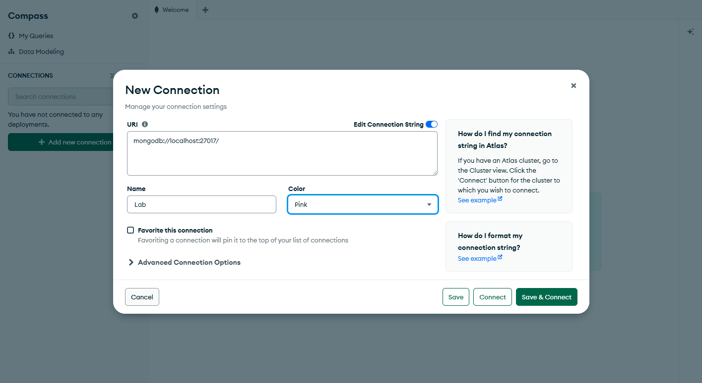

### Створення колекцій для бази данних
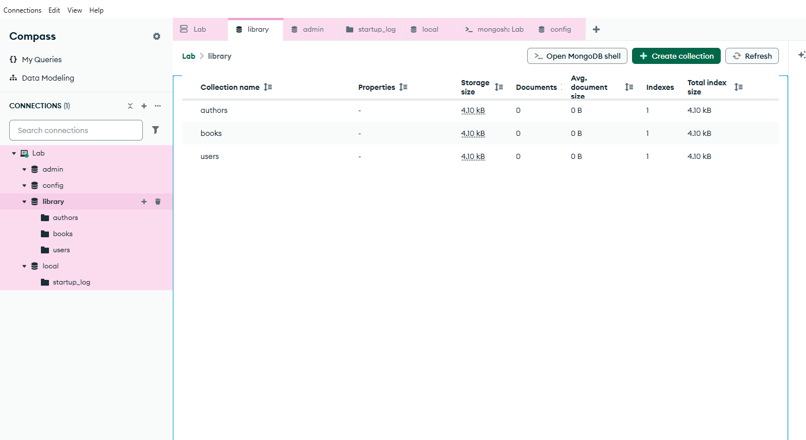

### Заповнення колекцій данними
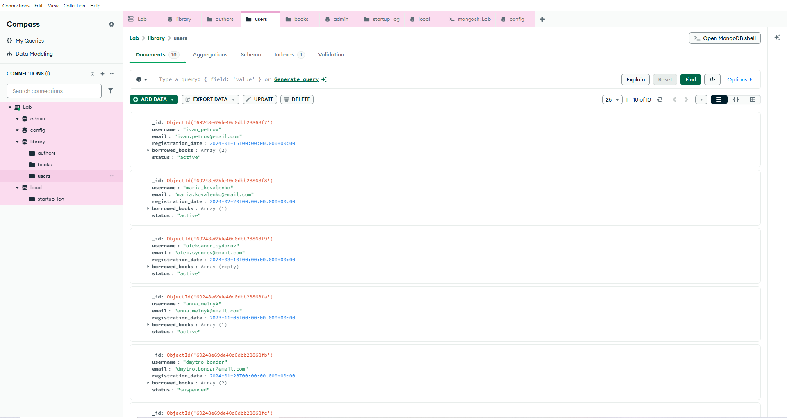
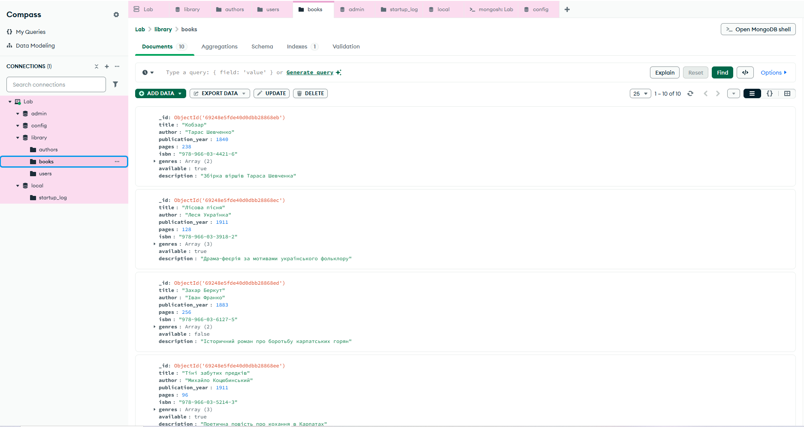
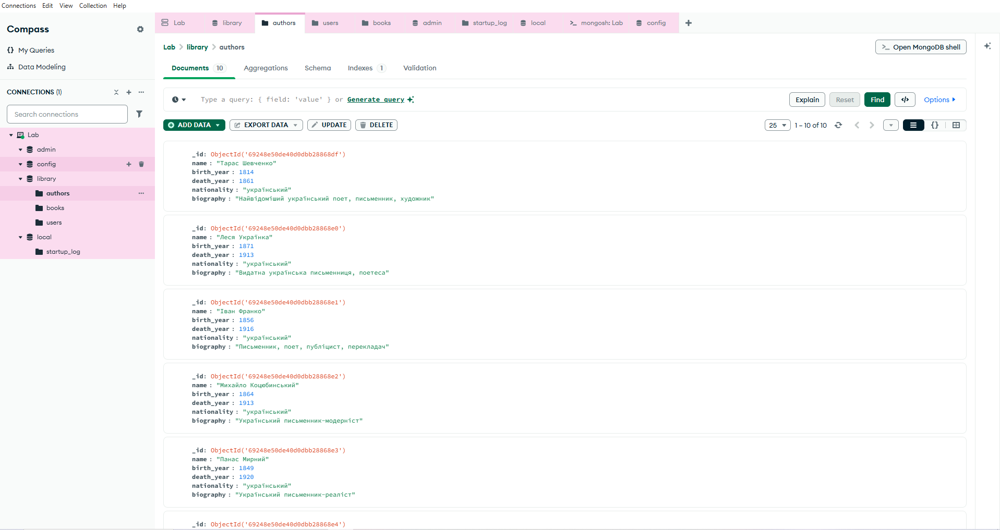

### Індекси, прості та складні запити
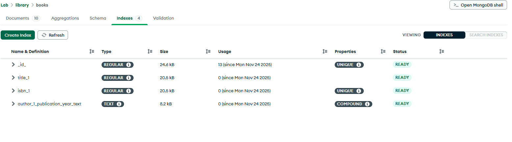
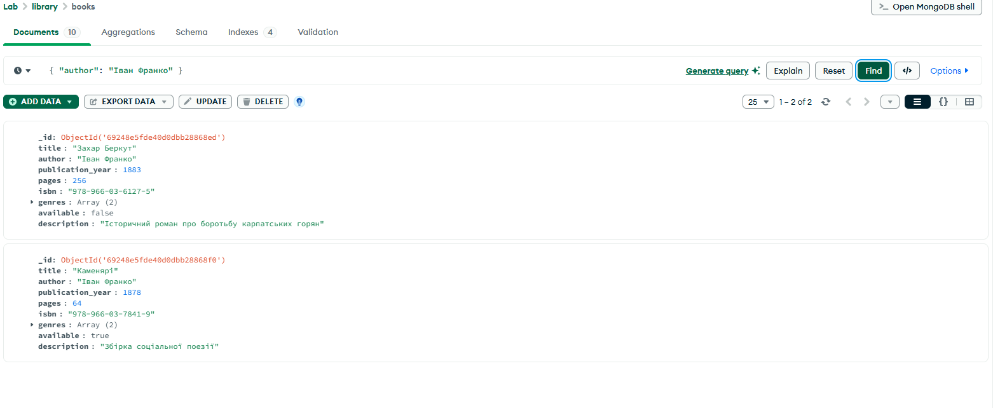
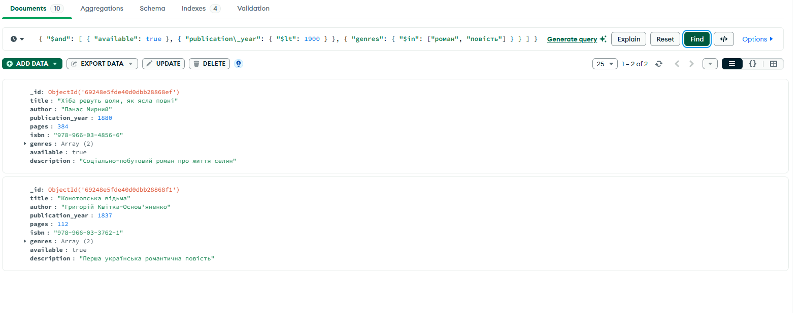

{
### Агрегація та звязки
##### Перше Genres_Count_Pipeline
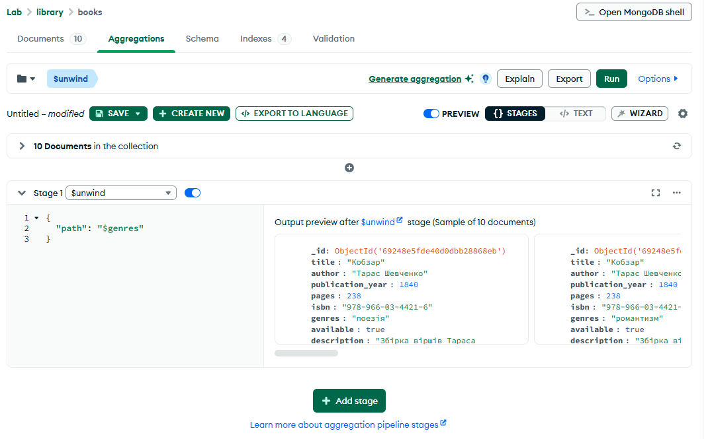
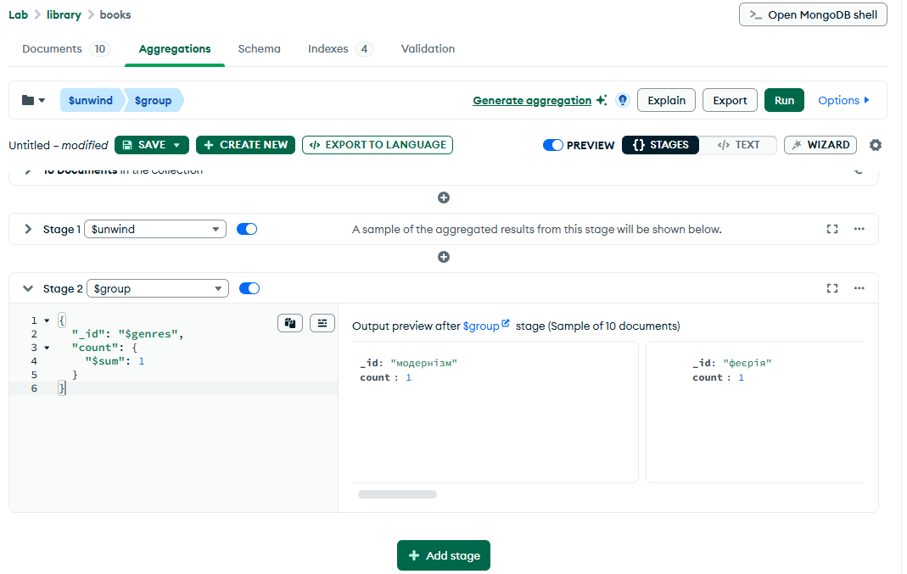
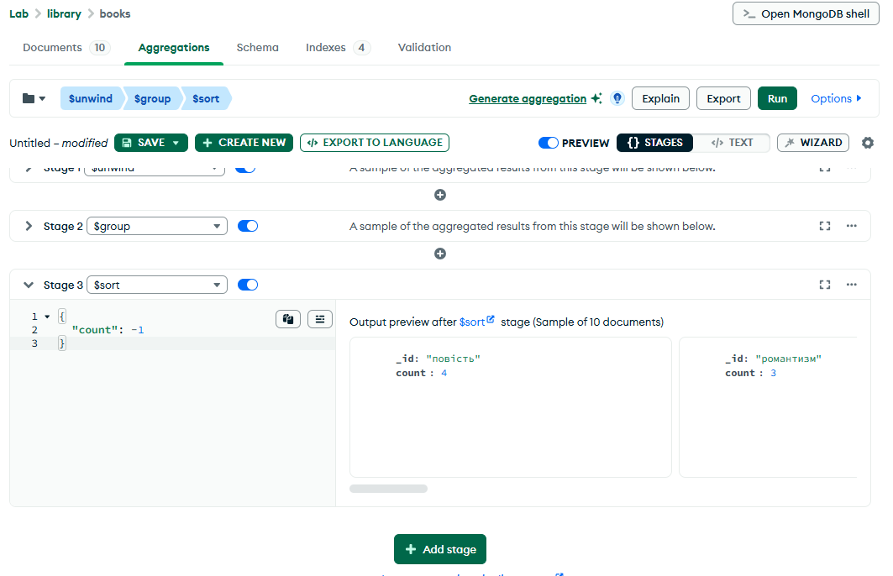

##### Друге Authors_Average_Pages
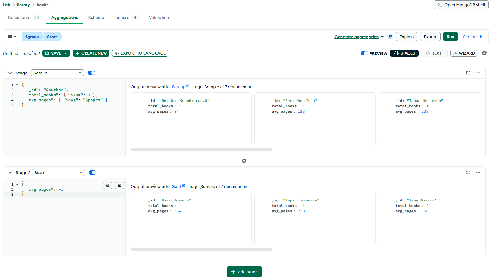

#### Результати
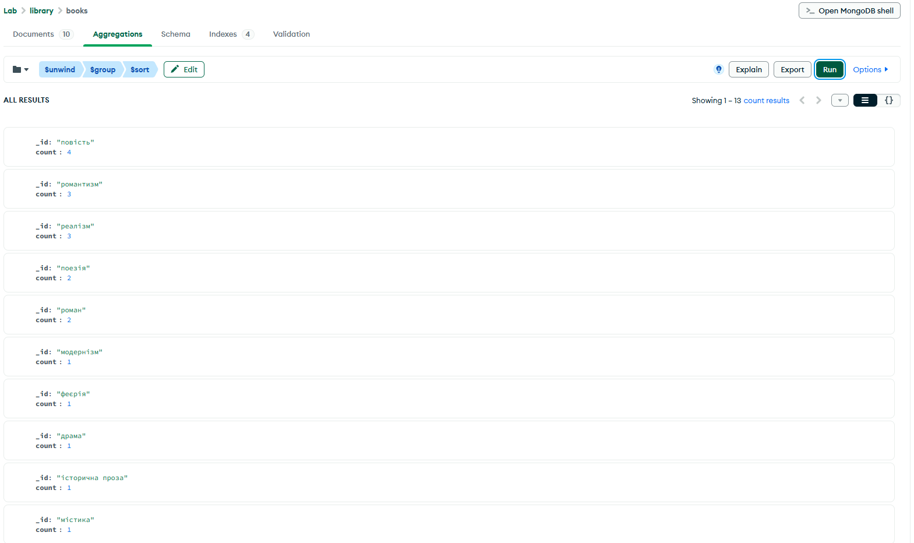
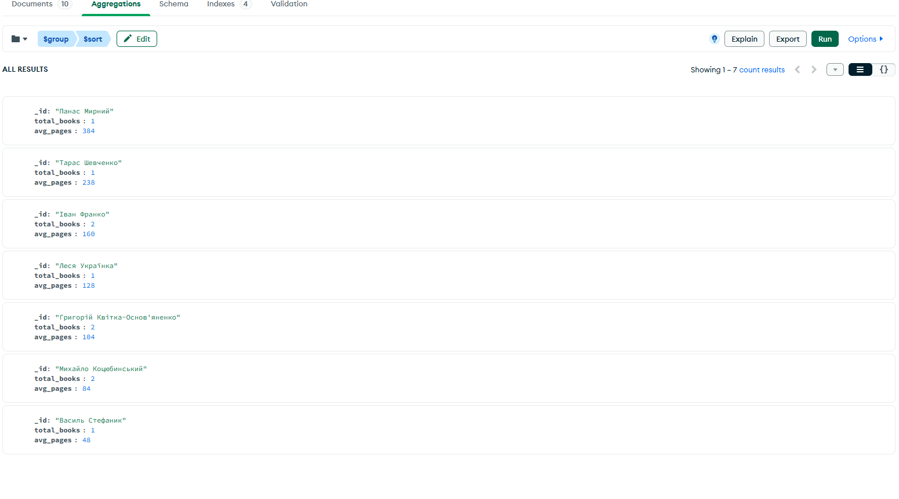
}

#### Створення View
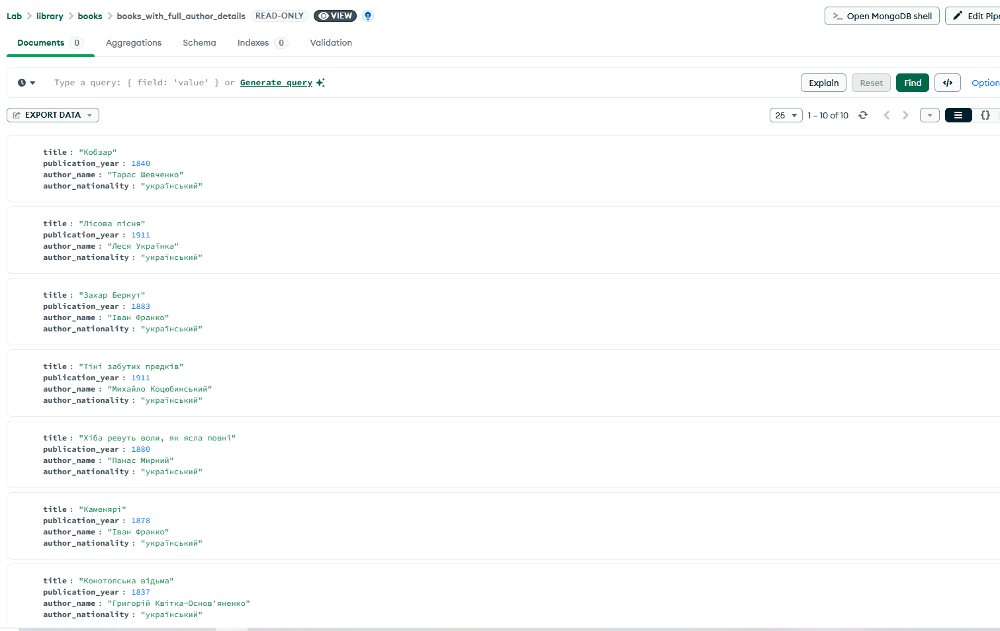

#### Додаваня Version i History
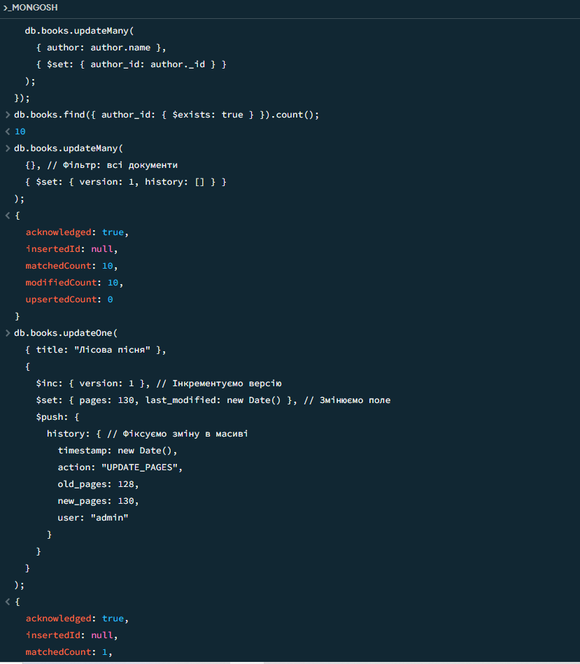

#### Створення геопросторових індексів
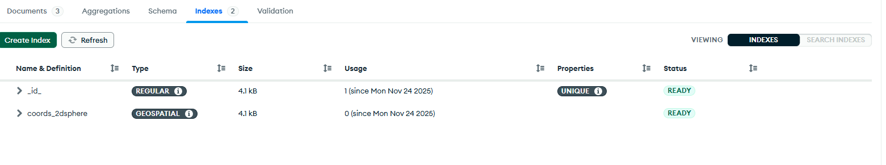

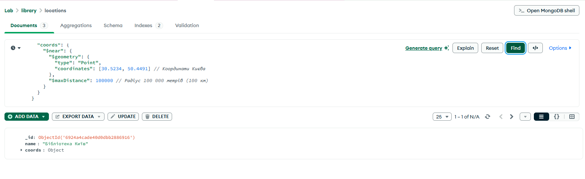
