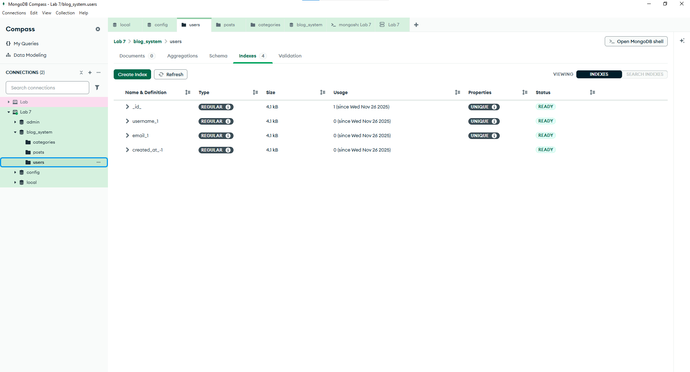
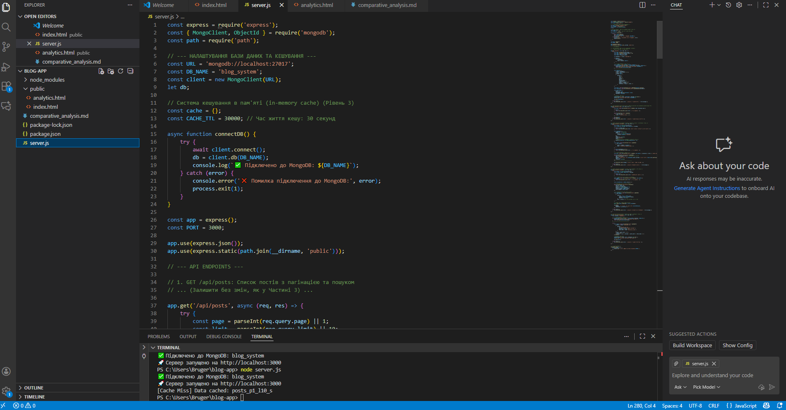
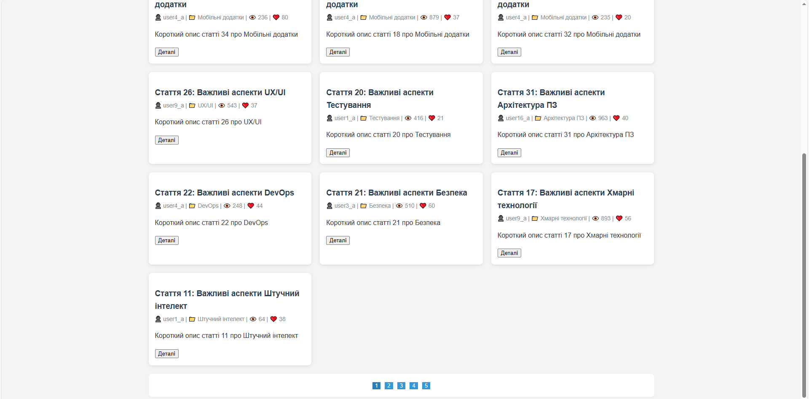
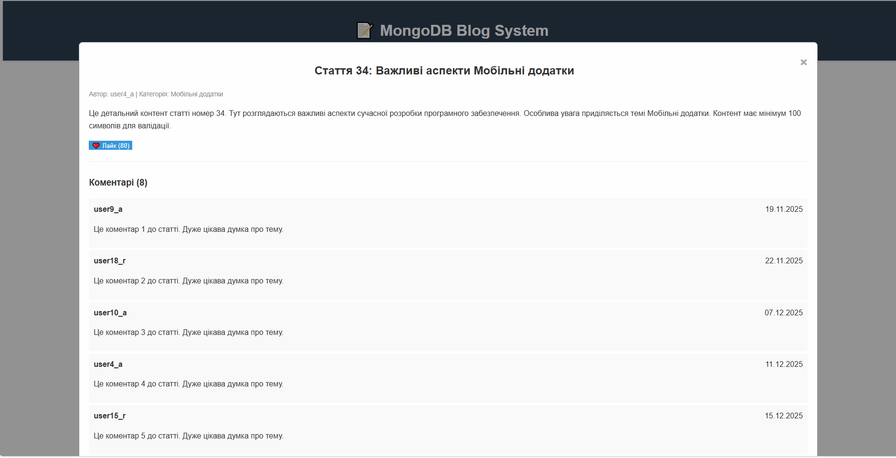

# 📄 Звіт з Лабораторної роботи №7: Повний цикл NoSQL застосунку з інтеграцією

## ℹ️ Загальна інформація
* **ПІБ студента:** [Бугайчук Денис Андрійович]
* **Група:** [ІПЗ-32]
* **Варіант (предметна область):** Блог-система (Blog System)
* **Рівень виконання:** **Рівень 3 (Творче розширення)**

---

## 🎯 Мета роботи

Застосування знань роботи з NoSQL базами даних для створення повноцінного вебзастосунку на основі MongoDB, проєктування документної схеми з урахуванням патернів доступу (вбудовування/посилання), реалізація розширеної функціональності (версіонування, кешування, геолокація) та інтеграція з фронтенд-технологіями (Node.js/Express та HTML/JavaScript).

---

## 1. Концептуальна та Документна Схеми (Рівень 1)

### 1.1. Документна Схема та Обґрунтування
Використано **Гібридний патерн**, оптимізований для швидкості читання:

* **Вбудовування (Embedding):** Колекція `posts` вбудовує **коментарі** (з `parent_id` для вкладеності), **статистику** (`views`, `likes`) та ключові **метадані автора/категорії**. Це забезпечує швидкість читання за один запит.
* **Посилання (Referencing):** Колекції `users` та `categories` зберігаються окремо.

#### Колекція `posts` (Приклад)
```javascript
{
  _id: ObjectId,
  title: String,
  author: { user_id: ObjectId, username: String, ... },
  comments: [ { comment_id: ObjectId, text: String, parent_id: ObjectId, ... } ], // Рівень 3
  statistics: { views: Number, likes: Number, comments_count: Number },
  location: { type: "Point", coordinates: [lon, lat] } // Рівень 3
}
```


### 1.2. Індекси та Оптимізація
Створено індекси для прискорення пошуку, сортування та забезпечення функціональності:

* **Унікальні:** `username: 1`, `email: 1`, `slug: 1`.
* **Складений:** `author.user_id: 1`, `created_at: -1`.
* **Текстовий:** `{ title: "text", content: "text", excerpt: "text" }` (Повнотекстовий пошук, Рівень 2).
* **Геопросторовий:** `{ location: "2dsphere" }` (Геолокація, Рівень 3).

Скріншот створених індексів:

---

## 2. Реалізація та Інтеграція Застосунку (Рівень 2/3)

### 2.1. RESTful API на Express.js
Розроблено бекенд на Node.js/Express, що обслуговує API-точки та статичний контент.

**Ключові реалізовані функції:**

* `GET /api/posts` – Отримання списку з пагінацією (`$skip/$limit`) та повнотекстовим пошуком (Рівень 2)
* `GET /api/posts/:slug` – Інкрементація лічильника переглядів (`$inc`) (Рівень 2)
* `POST /api/posts/:id/like` – Система рейтингів (`$inc`) (Рівень 2)
* `POST /api/posts` – Додавання нових постів через вебформу (Рівень 2)
* `POST /api/posts/:id/update` – Оновлення та версіонування (Рівень 3)
* `POST /api/posts/:id/comment` – Додавання вкладених коментарів та сповіщень (Рівень 3)

Скріншот роботи вебзастосунку з відображенням постів та пагінацією:


### 2.2. Візуалізація
Виконано агрегаційні запити для підрахунку статистики (Топ 10 авторів, популярні категорії).

Скріншоти виконання:
 

 

---

## 3. Творче Розширення (Рівень 3)

### 3.1. Версіонування та Історія
Створено окрему колекцію `post_history` (з індексом `post_id`, `version`).  
При оновленні посту (`POST /api/posts/:id/update`) старий стан зберігається як знімок (`content_snapshot`), а в основному документі інкрементується поле `version`.

### 3.2. Система Кешування (Performance)
Реалізовано кешування в пам'яті (in-memory cache) для ендпоінтів `/api/posts` та `/api/stats/top-authors` з TTL 30 секунд.  
При записі або оновленні кеш автоматично очищається, що знижує навантаження на БД.

### 3.3. Сповіщення та Коментарі
* **Вкладені коментарі:** Поле `parent_id` додано до кожного вбудованого коментаря.
* **Сповіщення:** При додаванні нового коментаря створюється запис у колекції `notifications` для автора посту.

### 3.4. Геолокація та Пошук
Документ `posts` містить поле `location`.  
Створено індекс `2dsphere`, що дозволяє виконувати геопросторовий пошук (`$near`, `$geoWithin`) постів.

Скріншот колекцій `post_history` та `notifications` (перевірка функцій Рівня 3):


---

## 4. Порівняльний Аналіз

| Критерій | SQL (Реляційна) | MongoDB (NoSQL) | Висновок |
|-----------|-----------------|-----------------|----------|
| Швидкість читання (Пост) | Повільно (потрібен складний JOIN) | Дуже швидко (один запит) | MongoDB оптимальніше для читання |
| Гнучкість схеми | Низька (міграції) | Висока | Дозволяє легко додавати поля (наприклад, location) |
| Масштабованість | Вертикальна | Горизонтальна (Шардинг) | Краще для високонавантажених вебзастосунків |
| Кешування запитів | Реалізовано в API/Redis | Реалізовано в API/Redis | Застосування кешування в MongoDB критично для продуктивності |

---

## 5. Висновки
У результаті виконання лабораторної роботи був розроблений повноцінний NoSQL-застосунок, який охоплює весь цикл – від проєктування документної схеми до інтеграції з Express.js та реалізації складних функцій Рівня 3.  

**Навички та здобутки:**
* Робота з агрегаційними pipeline
* Індексування для геопошуку
* Стратегії кешування для підвищення продуктивності документо-орієнтованих систем

**Самооцінка:** 5/5  
**Обґрунтування:** Робота виконана на максимальному Рівні 3, включаючи всі обов'язкові та творчі завдання (схема, індекси, агрегація, API, пагінація, кешування, версіонування, геолокація), що підтверджує глибоке розуміння архітектури та повного циклу розробки NoSQL-застосунку.

