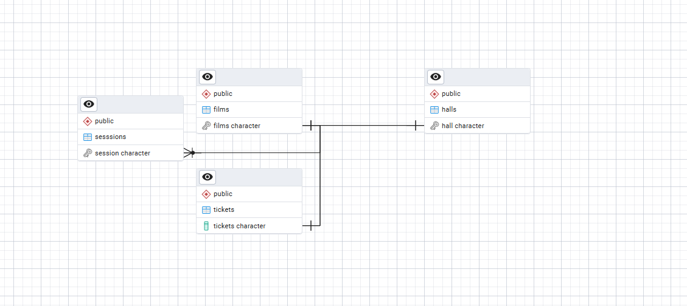
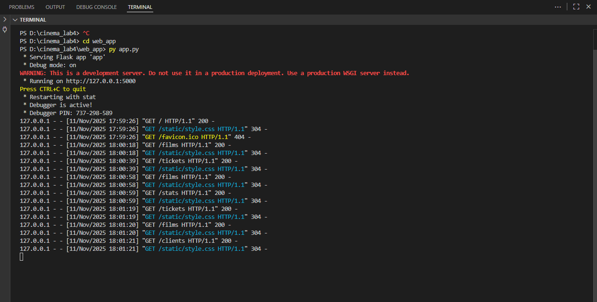
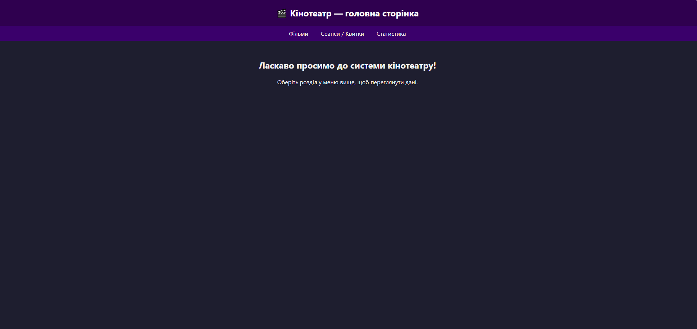
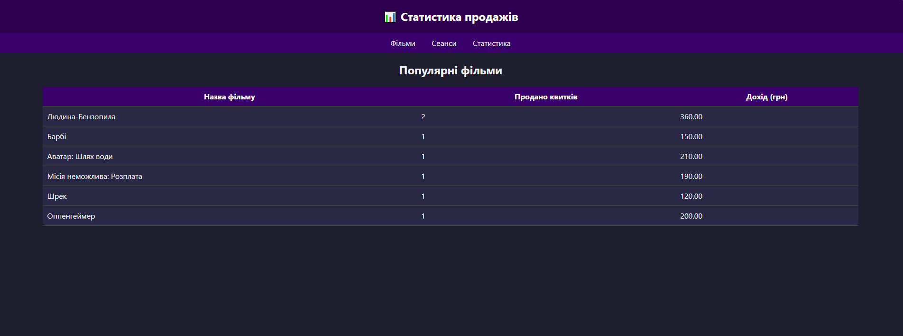
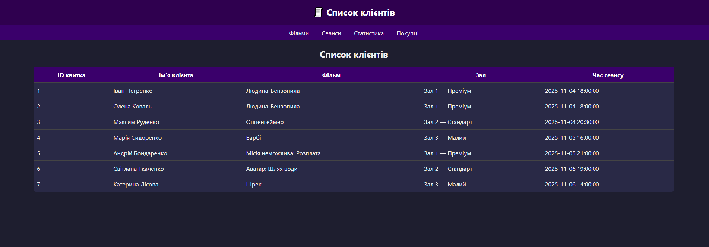

# Звіт з лабораторної роботи №4

## Загальна інформація
- ПІБ студента: Бугайчук Денис Андрійович
- Група: ІПЗ-32
- Варіант (предметна область): База даних кінотеатру
- Рівень виконання: 3 рівень

## Опис предметної області
[Система призначена для зберігання та обробки інформації про фільми, зали, сеанси й продані квитки.
Основні можливості системи:

зберігання даних про фільми (назва, жанр, тривалість, ціна, рік виходу);

управління залами та розкладом сеансів;

фіксація продажів квитків клієнтам;

автоматичне оновлення даних за допомогою тригерів;

перегляд статистики та інтерактивна робота через веб-інтерфейс.]

## Концептуальна модель
[Сутності:

Фільм (Film) — має назву, жанр, рік випуску, тривалість, ціну квитка.

Зал (Hall) — визначається номером і кількістю місць.

Сеанс (Session) — вказує фільм, зал і час показу.

Квиток (Ticket) — містить інформацію про клієнта, куплений сеанс і час покупки.

Зв’язки:

Один фільм може мати багато сеансів.

Один сеанс проходить у одному залі.

Один клієнт може купити кілька квитків.]


## Логічна схема
[Таблиці:

films(film_id, title, genre, duration, price, release_year)

halls(hall_id, name, capacity)

sessions(session_id, film_id, hall_id, session_time)

tickets(ticket_id, session_id, customer_name, purchase_time)

Зв’язки:

sessions.film_id → films.film_id

sessions.hall_id → halls.hall_id

tickets.session_id → sessions.session_id]

## Реалізація в PostgreSQL
[Основні SQL-скрипти:

01_create_tables.sql — створення таблиць
02_insert_data.sql — додавання прикладів даних
03_create_views.sql — представлення для зручного перегляду
04_create_procedures.sql — процедури (наприклад, підрахунок квитків)
05_create_triggers.sql — тригери, що автоматично оновлюють дані при покупці квитка]

## Налаштування Docker
[Docker не використовується у цьому варіанті.]

## SQL-запити
[Нижче наведено приклади запитів, реалізованих у базі даних кінотеатру:

## 1. Вивести всі фільми, які показуються у кінотеатрі

```sql
SELECT title, genre, duration, release_date
FROM films;
​`​`​`
### Пояснення:
Запит виводить основну інформацію про всі фільми, збережені в таблиці films.


## 2. Вивести всі сеанси із зазначенням фільму та залу
​
```sql
SELECT s.session_id, f.title AS film, h.name AS hall, s.session_time
FROM sessions s
JOIN films f ON s.film_id = f.film_id
JOIN halls h ON s.hall_id = h.hall_id;
```

### Пояснення:
Використано JOIN для поєднання трьох таблиць і отримання зведеної інформації про сеанси.

## 3. Знайти кількість проданих квитків на кожен фільм

SELECT f.title, COUNT(t.ticket_id) AS sold_tickets
FROM tickets t
JOIN sessions s ON t.session_id = s.session_id
JOIN films f ON s.film_id = f.film_id
GROUP BY f.title;


Пояснення:
Агрегатна функція COUNT() дозволяє порахувати кількість квитків для кожного фільму.

## 4. Пошук фільмів за жанром (реалізація фільтрації)

SELECT * FROM films
WHERE genre ILIKE '%' || %(genre)s || '%';


Пояснення:
Цей запит використовується у вебінтерфейсі /films для фільтрації фільмів за введеним жанром.]

## Консольний застосунок
[]


## Вебзастосунок 
[





]


## Розширена функціональність (рівень 3, якщо реалізовано)
[Реалізовано фільтрацію фільмів за жанром на сторінці /films через HTML-форму та SQL LIKE-запит:
@app.route('/films', methods=['GET', 'POST'])
def films():
    if request.method == 'POST':
        genre_filter = request.form.get('genre')
        query = """
            SELECT film_id, title, genre, duration, price, release_year
            FROM films
            WHERE LOWER(genre) LIKE LOWER(%s)
            ORDER BY title;
        """
        films_data = fetch_all(query, ('%' + genre_filter + '%',))
    else:
        query = "SELECT * FROM films ORDER BY title;"
        films_data = fetch_all(query)
    return render_template('films.html', films=films_data)

Це дозволяє користувачу ввести жанр (наприклад, "Горор") і побачити лише відповідні фільми.
]

## Висновки
[У ході виконання лабораторної роботи:

Створено базу даних «Кінотеатр» у PostgreSQL;

Реалізовано таблиці, зв’язки, представлення, процедури та тригери;

Побудовано консольний і вебінтерфейс для взаємодії з базою;

Реалізовано додаткову функціональність — фільтрацію за жанром;

Набуто практичних навичок роботи з SQL, PostgreSQL та Flask.

💡 Результатом є повноцінна система управління кінотеатром із можливістю перегляду, продажу квитків і фільтрації фільмів через вебінтерфейс.

]


