# Лабораторна робота 2. Створення складних SQL запитів

## Загальна інформація
**Здобувач освіти:** [Бугайчук Денис Андрійович]  
**Група:** [ІПЗ-32]  
**Обраний рівень складності:** 1,2,3  
**Посилання на проєкт:** [https://supabase.com/dashboard/project/sgqvnuoygpyzxqghoytt](https://supabase.com/dashboard/project/sgqvnuoygpyzxqghoytt)  

---

## Виконання завдань

## 🔹 Рівень 1
{
### 1. З'єднання таблиць:

#### SELECT o.order_id, c.contact_name, o.order_date
#### FROM orders o
#### JOIN customers c ON o.customer_id = c.customer_id;

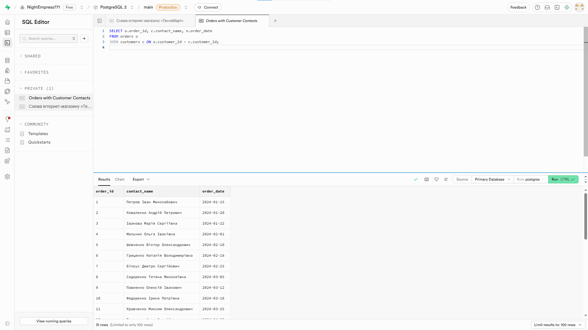 
#### Вивести список замовлень із ПІБ клієнта та датою замовлення.

### 2. Створити запити з використанням INNER JOIN для отримання інформації з кількох пов'язаних таблиць

#### SELECT p.product_name, c.category_name
#### FROM products p
#### INNER JOIN categories c ON p.category_id = c.category_id;

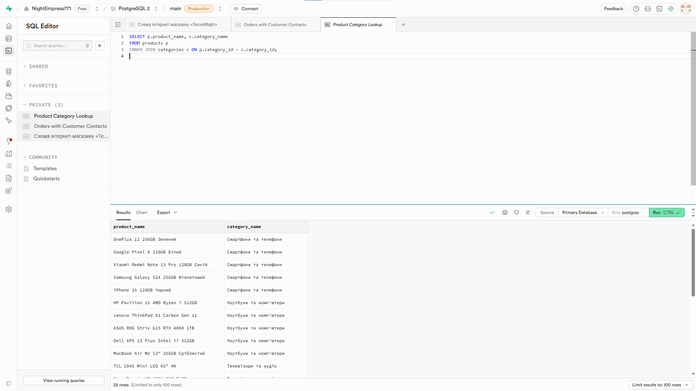
#### Вивести товари та їхні категорії.

### 3. Використати LEFT JOIN для включення всіх записів з головної таблиці

#### SELECT cu.contact_name, o.order_id, o.order_date
#### FROM customers cu
#### LEFT JOIN orders o ON cu.customer_id = o.customer_id;

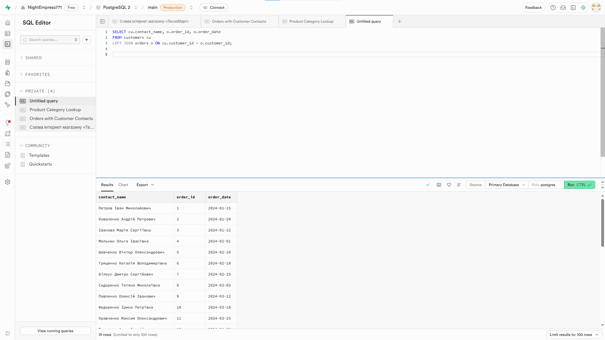
#### Вивести всіх клієнтів і їхні замовлення (навіть якщо замовлень немає).

### 4. Створити запит з множинними з'єднаннями (мінімум 3 таблиці)

#### SELECT o.order_id, cu.contact_name, p.product_name, s.company_name AS supplier
#### FROM orders o
#### JOIN customers cu ON o.customer_id = cu.customer_id
#### JOIN order_items oi ON o.order_id = oi.order_id
#### JOIN products p ON oi.product_id = p.product_id
#### JOIN suppliers s ON p.supplier_id = s.supplier_id;

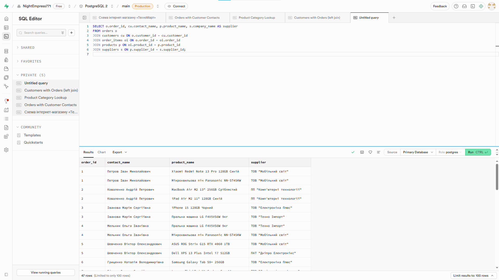
#### Вивести інформацію про замовлення: клієнт, товар, постачальник.

### 5. Агрегатні функції

#### SELECT COUNT(*) AS total_products
#### FROM products;

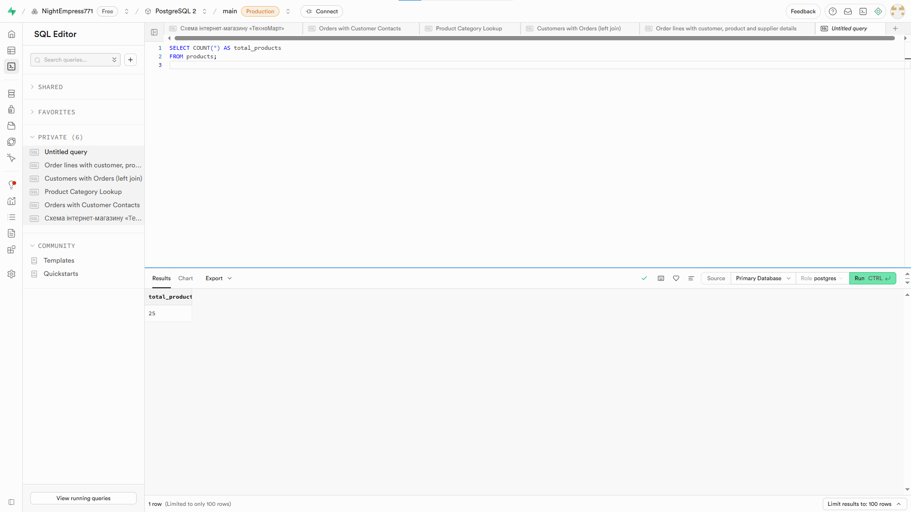 
#### Порахувати кількість товарів у таблиці.

### 6. Використати функції COUNT, SUM, AVG, MIN, MAX для обчислення статистичних показників

#### SELECT 
 ####    COUNT(*) AS total_products,
 ####    SUM(unit_price) AS sum_prices,
  ####   AVG(unit_price) AS avg_price,
  ####   MIN(unit_price) AS min_price,
 ####    MAX(unit_price) AS max_price
#### FROM products;

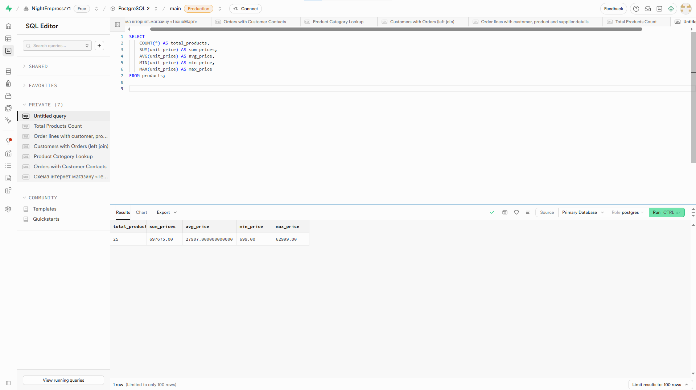
#### Порахувати статистику цін товарів.

### 7. Створити запити з GROUP BY для групування даних за різними критеріями

#### SELECT c.category_name, COUNT(p.product_id) AS product_count
#### FROM categories c
#### LEFT JOIN products p ON c.category_id = p.category_id
#### GROUP BY c.category_name;

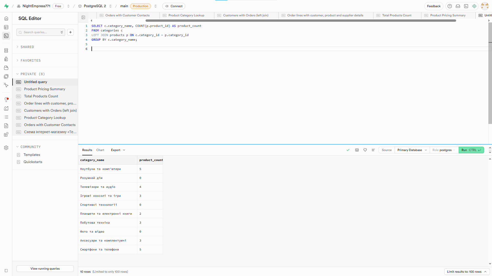
#### Кількість товарів у кожній категорії.

### 8. Застосувати HAVING для фільтрації груп за умовами

#### SELECT c.category_name, COUNT(p.product_id) AS product_count
#### FROM categories c
#### JOIN products p ON c.category_id = p.category_id
#### GROUP BY c.category_name
#### HAVING COUNT(p.product_id) > 3;

#### Категорії, в яких більше ніж 3 товари.

### 9. Базові підзапити

#### SELECT product_name, unit_price
#### FROM products
#### WHERE unit_price > (SELECT AVG(unit_price) FROM products);

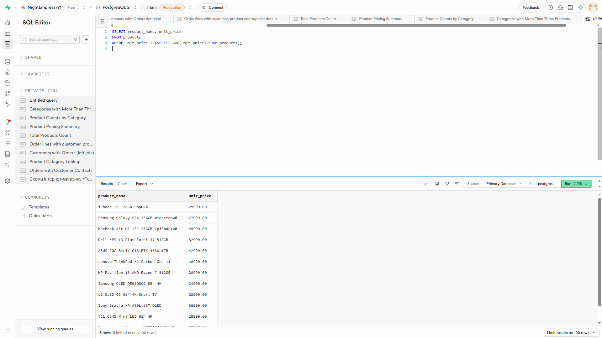
#### Знайти товари, ціна яких вища за середню.

### 10. Створити підзапит у розділі WHERE для фільтрації записів

#### SELECT contact_name
#### FROM customers
#### WHERE customer_id IN (SELECT DISTINCT customer_id FROM orders);

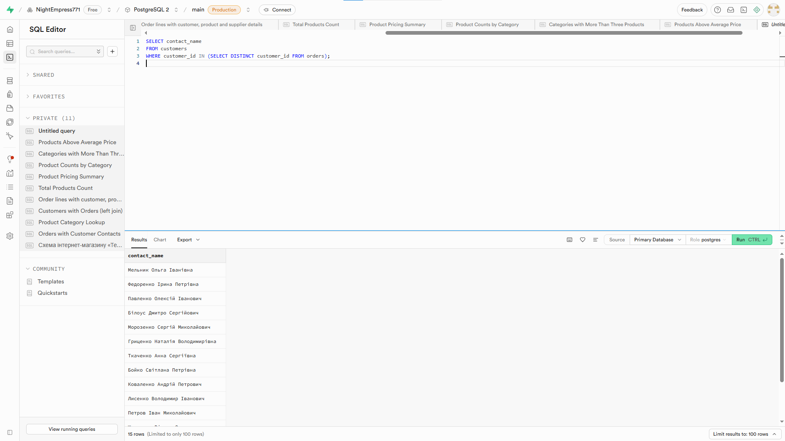
#### Вивести клієнтів, які робили замовлення.

### 11. Використати підзапит у розділі SELECT для додавання обчислювальних полів

#### SELECT c.contact_name,
####        (SELECT COUNT(*) 
####         FROM orders o 
####         WHERE o.customer_id = c.customer_id) AS total_orders
#### FROM customers c;

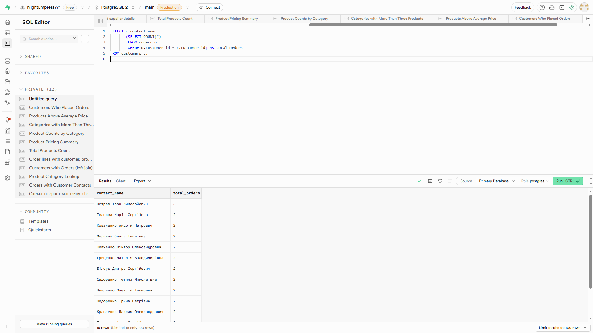
#### Додати до списку клієнтів кількість їхніх замовлень.

### 12. Реалізувати запит з використанням операторів IN та EXISTS

#### SELECT o.order_id, o.order_date, c.contact_name
#### FROM orders o
#### JOIN customers c ON o.customer_id = c.customer_id
#### WHERE EXISTS (
####     SELECT 1
####     FROM order_items oi
####     JOIN products p ON oi.product_id = p.product_id
####     JOIN categories cat ON p.category_id = cat.category_id
####     WHERE oi.order_id = o.order_id
#### AND cat.category_name = 'Смартфони та телефони' );

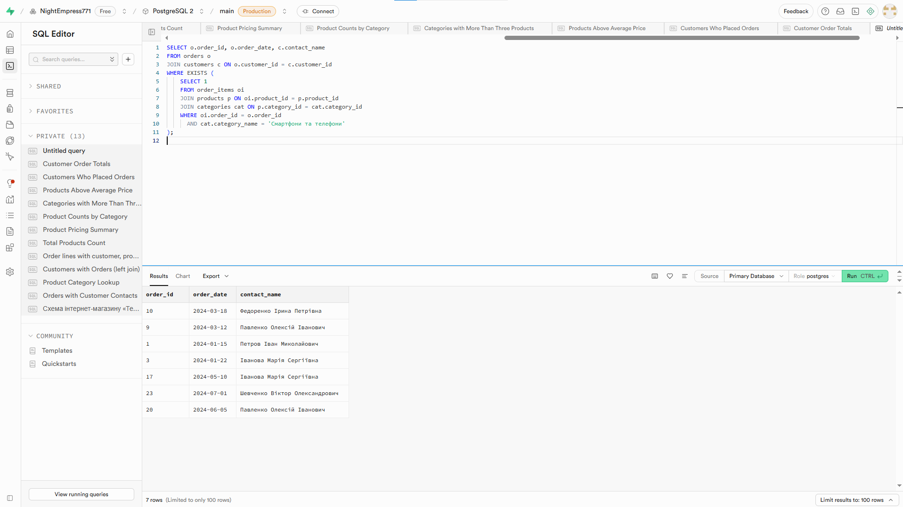
#### Вивести замовлення, що містять товар із категорії "Смартфони та телефони".

}

---

## 🔹 Рівень 2

### 1.  Складні з'єднання та аналіз

#### SELECT 
####     o.order_id,
####     c.contact_name AS customer,
####     p.product_name,
####     e.first_name || ' ' || e.last_name AS employee,
####     o.order_date
#### FROM orders o
#### JOIN customers c ON o.customer_id = c.customer_id
#### JOIN order_items oi ON o.order_id = oi.order_id
#### JOIN products p ON oi.product_id = p.product_id
#### JOIN employees e ON o.employee_id = e.employee_id;

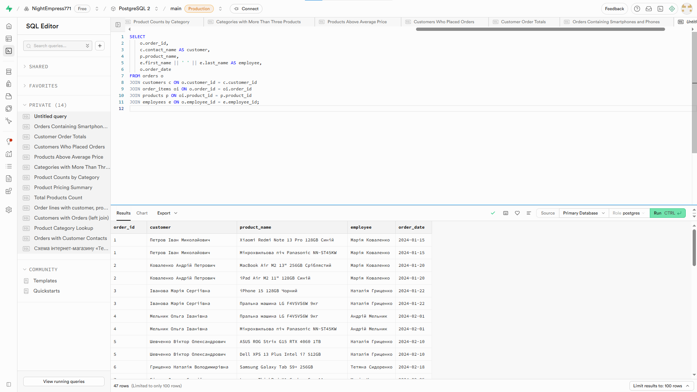
#### Вивести замовлення з клієнтом, товаром і менеджером, що його обробляв.

### 2. Створити запит з RIGHT JOIN та FULL OUTER JOIN

#### (1)

#### SELECT p.product_name, oi.order_id
#### FROM order_items oi
#### RIGHT JOIN products p ON oi.product_id = p.product_id;

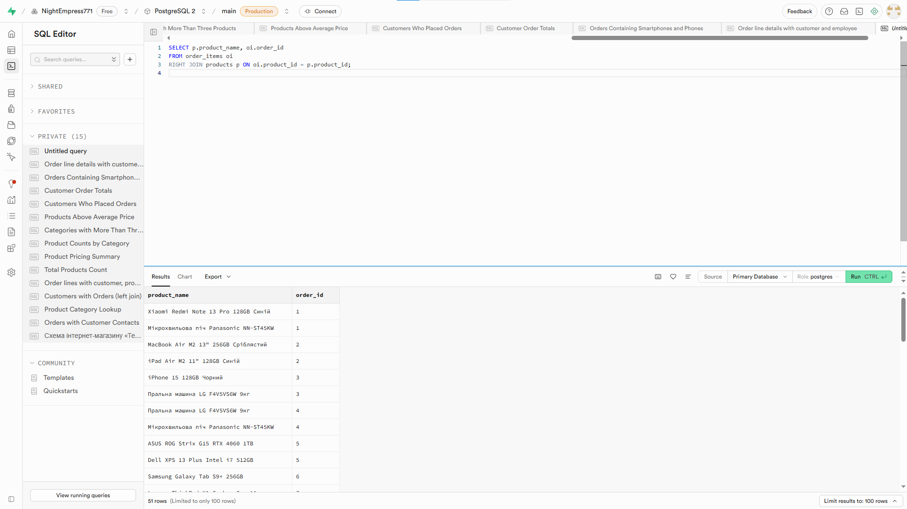
#### усі товари, навіть без замовлень

#### (2)

#### SELECT c.contact_name, o.order_id, o.order_date
#### FROM customers c
#### FULL OUTER JOIN orders o ON c.customer_id = o.customer_id;

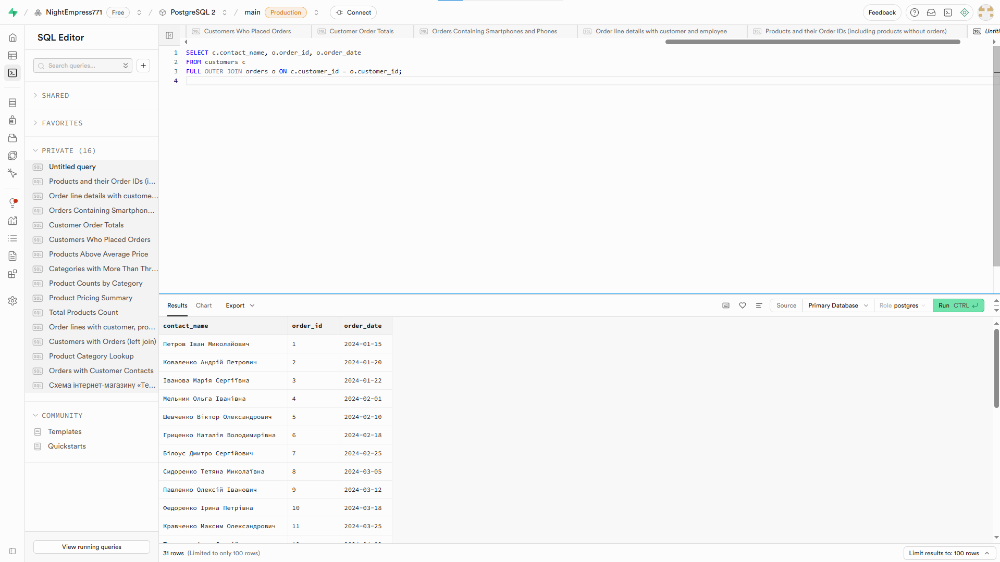
#### усі клієнти й усі замовлення

### 3. Реалізувати самоз'єднання (self-join) таблиці

#### SELECT e.first_name || ' ' || e.last_name AS employee,
####        m.first_name || ' ' || m.last_name AS manager
#### FROM employees e
#### LEFT JOIN employees m ON e.reports_to = m.employee_id;

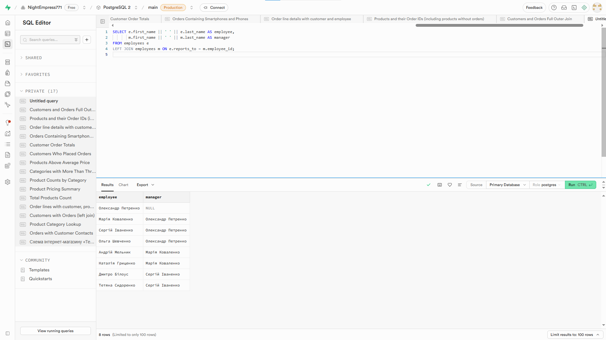
#### Вивести працівників і їхніх керівників (reports_to).

### 4. Створити запит з умовним з'єднанням (з додатковими умовами в ON)

#### SELECT o.order_id, p.product_name, oi.unit_price, oi.quantity
#### FROM orders o
#### JOIN order_items oi ON o.order_id = oi.order_id
#### JOIN products p ON oi.product_id = p.product_id
 ####    AND oi.unit_price > 20000;

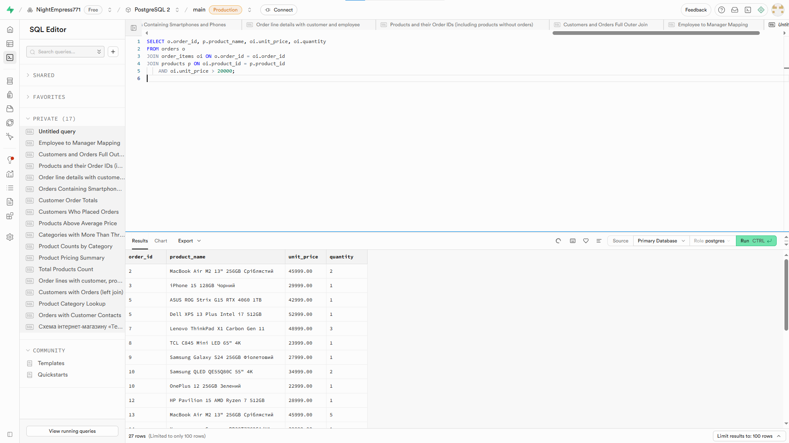
#### Вивести замовлення і товари з ціною понад 20 000 грн.

### 5. Вікні функції та аналітика

#### SELECT o.order_id, c.contact_name, o.order_date,
####        ROW_NUMBER() OVER (ORDER BY o.order_date) AS row_num
#### FROM orders o
#### JOIN customers c ON o.customer_id = c.customer_id;

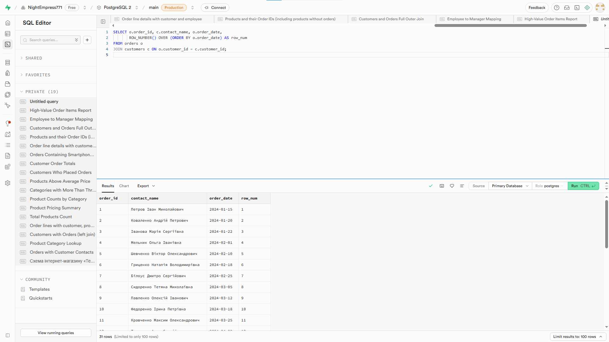
#### Вивести замовлення клієнтів із нумерацією рядків.

### 6. Використати ROW_NUMBER(), RANK(), DENSE_RANK() для ранжування

#### SELECT product_name, unit_price,
####        ROW_NUMBER() OVER (ORDER BY unit_price DESC) AS row_number,
 ####       RANK() OVER (ORDER BY unit_price DESC) AS rank_num,
 ####       DENSE_RANK() OVER (ORDER BY unit_price DESC) AS dense_rank_num
#### FROM products;

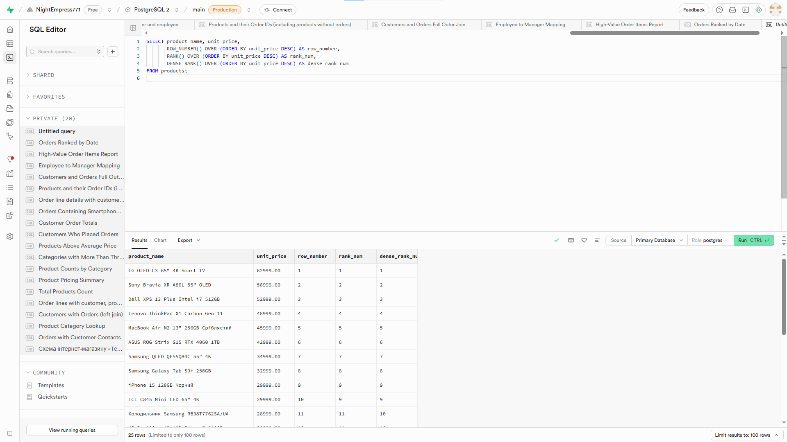
#### Ранжування товарів за ціною.

### 7. Застосувати LAG(), LEAD() для порівняння з попередніми/наступними записами

#### SELECT product_name, unit_price,
####        LAG(unit_price) OVER (ORDER BY unit_price) AS prev_price,
 ####       LEAD(unit_price) OVER (ORDER BY unit_price) AS next_price
#### FROM products;

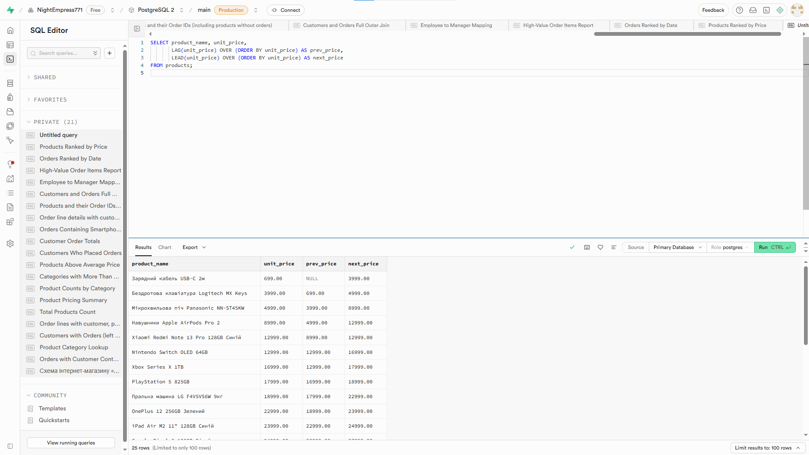
#### Порівняння цін товарів із попереднім і наступним.

### 8. Створити запити з PARTITION BY для аналізу в розрізах

#### SELECT o.order_id, c.contact_name, o.order_date,
####        COUNT(*) OVER (PARTITION BY c.customer_id) AS total_orders_by_customer
#### FROM orders o
#### JOIN customers c ON o.customer_id = c.customer_id;

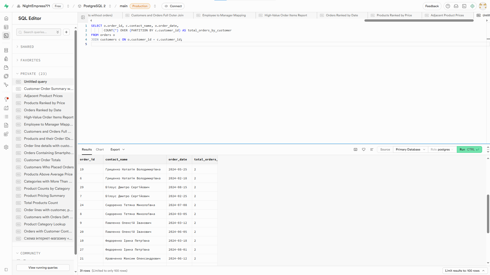
#### Порахувати кількість замовлень по кожному клієнту, але показати кожне замовлення окремо.
---

## 🔹 Рівень 3

### 1. Оптимізація та складна аналітика

#### SELECT 
 ####    DATE_TRUNC('month', o.order_date) AS month,
 ####    COUNT(DISTINCT o.order_id) AS orders_count,
 ####    SUM(oi.unit_price * oi.quantity * (1 - oi.discount)) AS revenue,
 ####    AVG(oi.unit_price * oi.quantity * (1 - oi.discount)) AS avg_order_value
#### FROM orders o
#### JOIN order_items oi ON o.order_id = oi.order_id
#### WHERE o.order_status = 'delivered'
#### GROUP BY DATE_TRUNC('month', o.order_date)
#### ORDER BY month;

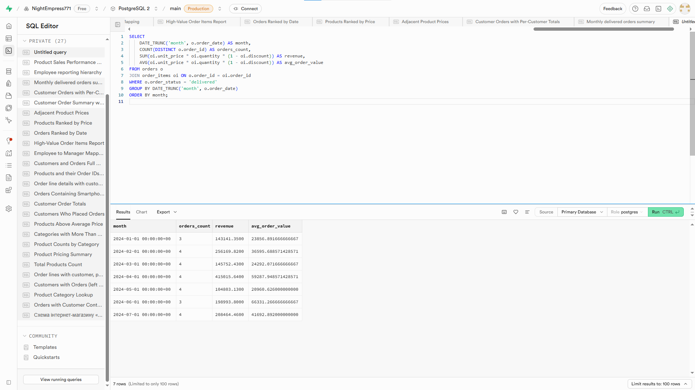
#### Підрахувати кількість замовлень, дату замовлення, сумму та середню сумму замовлення

### 2. Створити матеріалізоване представлення (materialized view) для складних запитів

#### -- 1. Безпечне видалення, щоб уникнути помилки "relation already exists"
#### DROP MATERIALIZED VIEW IF EXISTS mv_product_sales_report;

#### -- 2. Створення Materialized View
#### CREATE MATERIALIZED VIEW mv_product_sales_report AS
#### SELECT
####     p.product_name,
####     c.category_name,
####     s.company_name AS supplier_name,
####     p.unit_price,
 ####    p.units_in_stock,
####     -- Загальна продана кількість
 ####    COALESCE(SUM(oi.quantity), 0) AS total_sold_quantity,
####     -- Загальний виторг (Ціна * Кількість * (1 - Знижка))
####     COALESCE(SUM(oi.unit_price * oi.quantity * (1 - oi.discount)), 0) AS total_delivered_revenue
#### FROM products p
#### JOIN categories c ON p.category_id = c.category_id
#### JOIN suppliers s ON p.supplier_id = s.supplier_id
#### LEFT JOIN order_items oi ON p.product_id = oi.product_id
#### -- Об'єднуємо лише з доставленими замовленнями для чистого виторгу
#### LEFT JOIN orders o ON oi.order_id = o.order_id AND o.order_status = 'delivered'
#### GROUP BY p.product_name, c.category_name, s.company_name, p.unit_price, p.units_in_stock
#### ORDER BY total_delivered_revenue DESC;

#### -- 3. Запит до створеного MV (працює миттєво)
#### SELECT * FROM mv_product_sales_report
#### WHERE total_sold_quantity > 0
#### LIMIT 10;

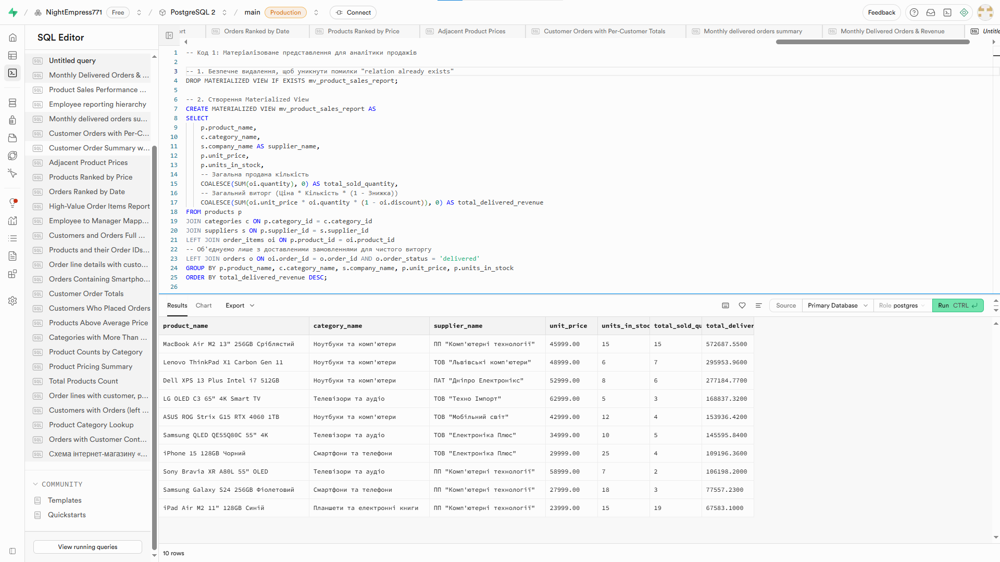
#### Звіт про загальний виторг кожного товару.

### 3. Реалізувати рекурсивний запит з використанням CTE (Common Table Expression)

#### -- Код 3: Рекурсивний CTE для ієрархії співробітників

#### WITH RECURSIVE employee_hierarchy AS (
####     -- Анкерний член: Вибираємо топ-керівника (reports_to = NULL)
####     SELECT
####         employee_id,
####         first_name || ' ' || last_name AS full_name,
####         title,
####         reports_to,
 ####        1 AS level
 ####    FROM employees
 ####    WHERE reports_to IS NULL

 ####    UNION ALL

 ####    -- Рекурсивний член: Знаходимо прямих підлеглих, збільшуючи рівень
 ####    SELECT
####         e.employee_id,
 ####        e.first_name || ' ' || e.last_name,
 ####        e.title,
 ####        e.reports_to,
 ####        h.level + 1 AS level
 ####    FROM employees e
 ####    JOIN employee_hierarchy h ON e.reports_to = h.employee_id)
#### -- Вибірка результатів, відсортованих за рівнем підпорядкування
#### SELECT
####     level,
####     full_name AS "Ім'я Співробітника",
####     title AS "Посада",
####     reports_to AS "ID Керівника"
#### FROM employee_hierarchy
#### ORDER BY level, full_name;

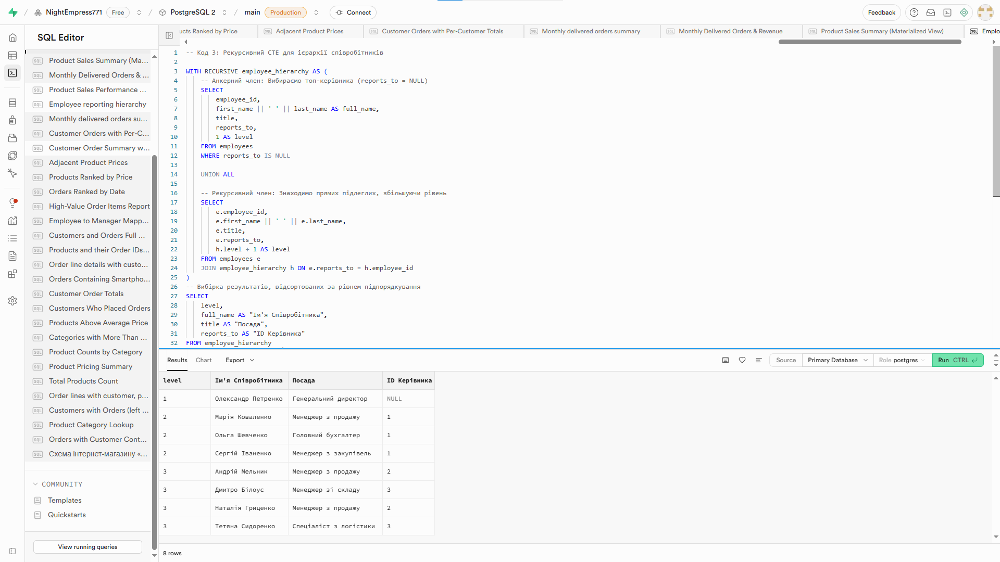
#### Таблиця ієрархії працівників

### 4. Створити запит з динамічним SQL або збереженою процедурою для параметризованої аналітики

#### -- 1. Створення функції, яка приймає параметр для сортування (назву стовпця)
#### CREATE OR REPLACE FUNCTION get_top_products_dynamic(
####     p_limit INT,
####     p_sort_by TEXT -- Параметр, що визначає стовпець для сортування (динамічна частина))
#### RETURNS TABLE (
####     product_name VARCHAR,
####     category_name VARCHAR,
####     total_sold_quantity BIGINT,
####     total_revenue NUMERIC)
#### LANGUAGE plpgsql
#### AS $$
#### DECLARE
####     -- Змінна для зберігання динамічно сформованого SQL-запиту
####     v_sql_query TEXT;
#### BEGIN
####     -- Перевірка безпеки: дозволяємо сортування лише за конкретними стовпцями
####     IF p_sort_by IS NULL OR p_sort_by NOT IN ('total_sold_quantity', 'total_revenue') THEN
####         RAISE EXCEPTION 'Недопустимий параметр сортування: %', p_sort_by;
####     END IF;
####     -- Формування динамічного SQL-запиту
####     v_sql_query := '
####         SELECT
####             p.product_name,
####             c.category_name,
####             COALESCE(SUM(oi.quantity), 0) AS total_sold_quantity,
####             COALESCE(SUM(oi.unit_price * oi.quantity * (1 - oi.discount)), 0) AS total_revenue
 ####        FROM products p
 ####        JOIN categories c ON p.category_id = c.category_id
####         LEFT JOIN order_items oi ON p.product_id = oi.product_id
####         LEFT JOIN orders o ON oi.order_id = o.order_id AND o.order_status = ''delivered''
####         GROUP BY p.product_name, c.category_name
####         ORDER BY ' || p_sort_by || ' DESC -- Динамічне поле для сортування
 ####        LIMIT ' || p_limit;
 ####    -- Виконання динамічного запиту та повернення результату
####     RETURN QUERY EXECUTE v_sql_query;
#### END;
#### $$;
#### -- 2. Приклад 1: Знайти ТОП-5 товарів за КІЛЬКІСТЮ проданих одиниць
#### SELECT * FROM get_top_products_dynamic(
####     5,
####     'total_sold_quantity');
#### -- 3. Приклад 2: Знайти ТОП-5 товарів за СУМОЮ виторгу
#### SELECT * FROM get_top_products_dynamic(
####     5,
####     'total_revenue');

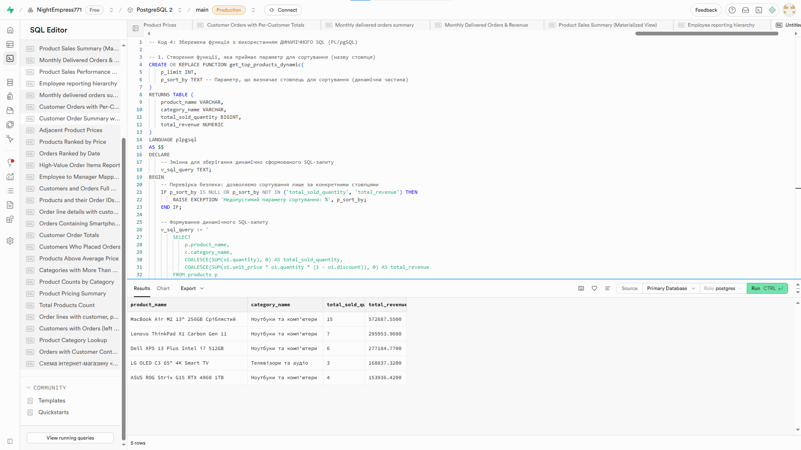
#### Pанжування товарів, де користувач може вибрати, ранжувати за кількістю продажу (total_sold_quantity) чи виторгом (total_revenue).

## Висновки

У ході виконання лабораторної роботи я:  
- Навчився виконувати запити з різними типами з’єднань таблиць (INNER, LEFT, RIGHT, FULL JOIN).
- Засвоїв використання агрегатних та аналітичних функцій (COUNT, SUM, AVG, RANK, LAG, LEAD).
- Створив підзапити, рекурсивні запити (CTE) та матеріалізовані представлення.
- Оптимізував SQL-запити та сформував аналітичний звіт із використанням збережених процедур. 

**Самооцінка:** 5/5  
